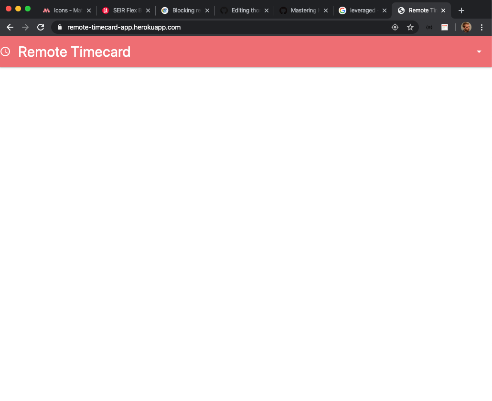

# Remote Timecard
A web app for logging remote job site geolocations and timestamps

## Overview

*Remote Timecard (RT)* is a simple, intuitive web application for keeping track of worker time punches that linked to the geolocation data of each punch. Designed for a catering company, this application verifies the workers' proximity to specific job sites based on a database of sites an admin user can make available.

## Technologies Used

*RT* uses MongoDB, Mongoose, Node.js, JavaScript, HTML, CSS and Materialize in addition to Google OAuth for authorizations. This full-stack web application leverages the HTML5 Geolocation API for caching the geolocation data of user Time Punches and Google Places API for an Admin User jobsite search feature that enables them to look for and add Job Site data objects to the database for linkage with worker Session timestamps. Using Materialize styling, this web application is formatted to be used on a mobile device or on a PC.

## Getting Started

If you have a google account, you are ready to take it for a test drive. Simply go to this here: https://remote-timecard-app.herokuapp.com/, login and complete Google OAuth and you will be redirected to the standard non-Admin worker views (see screenshots for worker views below). Upon login the non-Admin user will land on the time punch screen and prompted to pick a job site and complete a Time Punch.

For those wishing to test drive the Admin User capabilities please contact me directly for those credentials. Admin Users have all the capabilities of the non-Admin user such as Time Punch and a Sessions index view, but also have editing/deleting capabilities, jobsite adding/viewing/searching access and full view of all workers' Session objects.

## Future Enhancements

The next steps for this application are some Admin User utilities such as an API Service, Job Site Reporting, and User Session Reporting that includes a bi-weekly hours-worked calculation feature.

## Screenshots

### Navigation and PC/Mobile Formatting

### Non-Admin User (Worker) Views

Time Punch Screen (non-Admin Homepage): 

Sessions Screen:

### Admin User Views

Job Sites Views:

Sessions Report Views:

